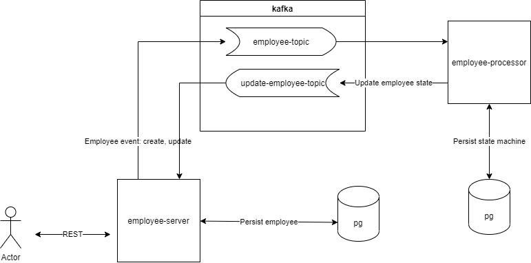

### Kafka & StateMachine demo

##### Build

`gradlew docker`

##### Run

`docker-compose up`

##### Docs

**employee-server**

- provide a REST API, available operations can be found at http://localhost:8080/swagger-ui.html
- publish messages to the `employee-topic` kafka topic on following operations:
    - new employee has been created
    - a new state should be evaluated for the provided employee
- consume messages from the `update-employee-topic` kafka topic. The message contain the identifier of employee and the
  new state.

**employee-processor**

- provide a state machine that is responsible for the employee registration workflow
- consume messages from the `employee-topic` kafka topic. The message contains the employee for whom the state machine
  should be created or a state machine event sent.
- publish messages to the `update-employee-topic` kafka topic.
